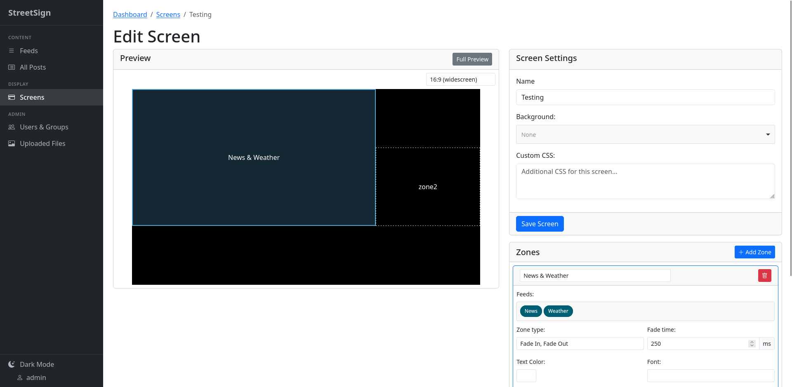

# StreetSign

<div align="center">
  
</div>

**A lightweight, self-hosted, plugin-extensible digital signage server.**
Point any browser at a URL and it becomes a screen

[](COPYING)
[](https://www.python.org/)
[](Dockerfile)



---

## What is StreetSign?

StreetSign is a self-contained web server for running digital signage. You
create and schedule posts (text, images, video, web pages, and more),
organise them into feeds, and arrange those feeds into zones on
configurable screen layouts.

Each physical display is just a browser — a PC, a Raspberry Pi, a smart TV, tablet, etc. pointed at a URL.
The display client loads its layout and continuously
polls the server for new content. Admins author and publish everything from a
web control panel; the server handles scheduling, permissions, and
housekeeping.

## Why StreetSign?

There are plenty of digital signage projects. StreetSign is built around a few
deliberate choices that set it apart:

- **Genuinely lightweight.** SQLite is the only datastore, and static assets
  are served in-process by [WhiteNoise](https://whitenoise.evans.io/)
  
  
- **Nothing to install on the screens.** Display clients are ordinary web
  browsers.
  
- **An editorial workflow.** Permissions are granted
  per-feed at three levels — **read**, **write**, and **publish** — to
  individual users *or* groups. Authoring and publishing are deliberately
  separate, so contributors can draft content while only trusted users push it
  live.

- **Extensible by dropping in a folder.** Both post types and external content
  importers are plugin systems: StreetSign auto-discovers any module under
  `streetsign_server/post_types/` or
  `streetsign_server/external_source_types/`. Post content is stored as JSON, so
  new post types need no database migration.

- **Automation-friendly.** A **web hook** post type fires HTTP requests on
  render, display, and hide — ideal for driving external stream players (e.g.
  VLC) or home/venue automation. RSS/Atom feeds and local image folders can be
  auto-imported on a schedule, with a preview before you commit.

- **Free, self-hosted, GPLv3.** Your content and database stay on your hardware.
 
## Use cases

StreetSign grew out of running signage for large conferences, and it's well
suited to anywhere you need flexible, multi-screen displays under your own
control:

- **Conferences & events** — different layouts per hall or stage, switched per
  display via client aliases; scheduled session info and announcements.
- **Churches & community spaces** — rotating notices, event listings, and
  RSS-imported news.
- **Offices & lobbies** — dashboards, welcome messages, embedded web pages.
- **Schools & campuses** — timetables, alerts, and per-department feeds.
- **Retail & hospitality** — menu boards, promotions, looping video.
- **Makerspaces & labs** — status screens driven by web hooks and automation.

## Features at a glance

### Content types

| Type | Description |
|------|-------------|
| **Plain Text** | Unformatted text, auto-scaled to fill the zone |
| **Rich Text** | Formatted content via WYSIWYG editor |
| **Image** | Uploaded images |
| **Video** | HTML5 video with loop — muted autoplay by default|
| **External Web Page** | Embeds any URL in a full-zone iframe |
| **Web hook** | POSTs to external URLs on render, display, and hide — for controlling stream players (e.g. VLC) or automation systems |
| **Raw HTML** | Arbitrary, unsanitised HTML rendered in a sandboxed iframe |

New post types can be added via the plugin system (`streetsign_server/post_types/`).

### Screen engines

Display clients load one of three rendering engines, selected per client alias:

| Engine | Technology |
|--------|-----------|
| **basic** | CSS3 transitions (`opacity` for fades, `translateX` for scroll)
| **notrans** | JavaScript `requestAnimationFrame` for scroll 
| **mobile** | Lightweight vanilla CSS 

### Scheduling

- **Post lifetime** — start/end dates and times, or mark a post
  "Show permanently" (never expires, never rotates)
- **Time-of-day restrictions** — blackout windows or exclusive windows
  (e.g. "only show between 09:00 and 17:00")
- **Day-of-week recurrence** — limit a post to specific weekdays
  (e.g. "only show on Mondays and Wednesdays") within its lifetime
- **Display duration** — how many seconds each post stays visible (2–100s)
- **Per-post font size** — override the automatic zone font scaling
- **Playlist ordering** — admins can reorder posts within a feed via
  up/down controls; posts cycle in sort order on display clients

### Permissions

Three permission levels per feed, assignable to users and groups:

- **Read** — view posts in the feed
- **Write** — create and edit posts
- **Publish** — mark posts ready for display (separate from write — the
  dashboard highlights unpublished posts)

Admins bypass all permission checks. Locked-out accounts are denied everything.
Sessions are tracked server-side and validated on every request.

## How it works

StreetSign is a single web server. Browsers acting as display clients load a
screen layout, then continuously poll for posts from the feeds assigned to each
zone.

Each screen layout is a set of rectangular **zones** positioned on a background.
Each zone subscribes to one or more feeds and cycles through their posts, using
either a **fade** (opacity cross-fade) or **scroll** (horizontal slide)
transition. Zones can be styled per-layout with custom CSS, background images,
user-uploaded fonts, and per-zone font and colour overrides.

**Client aliases** map a short access key (like `/client/mainhall`) to a
specific screen + engine combination with display overrides (aspect ratio,
fade time, scroll speed). Different physical displays can use different layouts
without ever changing the bookmark on the client.

External content can be imported automatically:

- **RSS / Atom feeds** — each entry is rendered through a Jinja2 template,
  sanitised with Bleach, and saved as a Rich Text post (with deduplication).
- **Local image folder** — a server-side directory is watched for new images,
  each becoming an Image post.

Both importers run on a configurable schedule, can optionally auto-publish, and
offer a test/preview button plus a manual "Run Now".

## Quick start

```bash
git clone https://github.com/jamswat/streetsign.git
cd streetsign
./setup.sh
./run.py
```

Open <http://localhost:5000> — default login is `admin` / `admin`.
**Change the password immediately** before deploying anywhere.

A fresh database is seeded with three demo accounts (password = login name):
`admin` (full admin), `editor` (write/publish on all feeds via the `editors`
group), and `viewer` (read-only). It also includes example feeds, posts, and a
ready-to-use two-zone `Default` screen at `/screens/basic/Default`.

## Docker

A multi-stage Docker image is built and published to
[GitHub Container Registry](https://github.com/jamswat/streetsign/pkgs/container/streetsign)
on every tagged release. The build compiles C extensions in a builder stage
and ships a slim final image (~45 MB) that runs as a non-root `streetsign`
user. Static assets are served in-process by WhiteNoise (no nginx sidecar
required), so the container can be exposed directly or placed behind any
reverse proxy.

### Quick start (pre-built image)

```bash
docker run -d --name streetsign -p 5000:5000 ghcr.io/jamswat/streetsign:latest
```

Open <http://localhost:5000> — default login is `admin` / `admin`.

To pull the latest stable release:

```bash
docker run -d --name streetsign -p 5000:5000 ghcr.io/jamswat/streetsign:latest
```

### docker-compose

```bash
docker compose up -d
```

The compose file pulls `ghcr.io/jamswat/streetsign:latest` 

This brings up a single `app` service on `${WEB_PORT:-5000}`. Two named volumes
are created automatically and persist across rebuilds:

| Volume      | Mount path                                    | Purpose                          |
|-------------|-----------------------------------------------|----------------------------------|
| `db_data`   | `/data`                                       | SQLite database                  |
| `uploads`   | `/app/streetsign_server/static/user_files`    | User-uploaded images, fonts, etc.|

Built-in static assets (`main.js`, `style.css`, `lib/`, `screens/`) are baked
into the image and are **not** mounted on a volume, so changes to them appear
on the next rebuild without stale-file masking. Only `user_files/` (runtime
uploads) is persisted.

### Building locally (alternative)

If you prefer to build the image yourself:

```bash
docker build -t streetsign .
docker run -d --name streetsign -p 5000:5000 streetsign
```

### Persistent data (plain `docker run`)

Mount volumes for the SQLite database and uploaded files, otherwise data is
lost when the container is removed:

```bash
docker run -d -p 5000:5000 \
  -v streetsign-db:/data \
  -v streetsign-uploads:/app/streetsign_server/static/user_files \
  ghcr.io/jamswat/streetsign:latest
```

On first start (empty `/data`), the container seeds a fresh database with the
default admin user, feeds, and a sample screen. On subsequent starts it only
runs pending migrations.

### Configuration

| Variable         | Default                              | Notes                                            |
|------------------|--------------------------------------|--------------------------------------------------|
| `SECRET_KEY`     | `dev-default-key-change-in-production` | Flask session-signing key. **Change this before deploying.** Generate one with `python3 -c "import uuid; print(uuid.uuid4())"` and pass via `-e SECRET_KEY=...` or a `.env` file. |
| `WEB_PORT`       | `5000`                               | Host port to publish (compose only)              |
| `PORT`           | `5000`                               | Port the server listens on inside the container  |
| `HOST`           | `0.0.0.0`                            | Bind address inside the container                |
| `DATABASE_FILE`  | `/data/database.db`                  | SQLite path (already volume-mounted in image)    |
| `LOG_LEVEL`      | `INFO`                               | Logging level: `DEBUG`, `INFO`, `WARNING`, `ERROR` |

Override at runtime, e.g. to serve on port 8080:

```bash
docker run -d -p 8080:8080 -e PORT=8080 ghcr.io/jamswat/streetsign:latest
```

Or with compose, publish on a different host port:

```bash
WEB_PORT=8080 docker compose up -d
```

For production you should mount your own `config.py` (see `config_default.py`
for the full list of options):

```bash
docker run -d -p 5000:5000 -v "$PWD/config.py:/app/config.py:ro" ghcr.io/jamswat/streetsign:latest
```

## Production

```bash
./run.py waitress
```

This runs the app under the [Waitress](https://github.com/Pylons/waitress) WSGI
server. Put it behind any reverse proxy you like (or expose it directly —
WhiteNoise handles static files in-process).

## Configuration

StreetSign loads `config.py` if present, falling back to the defaults in
`config_default.py`. Don't edit `config_default.py`; instead copy the values
you want to change into `config.py`. Common environment variables
(`SECRET_KEY`, `DATABASE_FILE`, `PORT`, `HOST`) are honoured directly.

## Upgrading

1. Back up `database.db` and `config.py` (see **Backup & Restore** below)
2. `git pull`
3. `make migrate`
4. Restart the server

## Backup & Restore

A naïve `cp database.db` can produce a corrupt copy because SQLite in WAL mode
also writes to `database.db-wal`. Use the built-in backup script, which uses
the SQLite online backup API to produce a consistent snapshot while the server
keeps running:

```bash
make backup
# or explicitly:
.virtualenv/bin/python scripts/backup_db.py /path/to/backup.db
```

In Docker, mount a backup volume and run it from cron:

```bash
docker exec streetsign python scripts/backup_db.py /backups/streetsign-$(date +%F).db
```

To restore, stop the server, replace `database.db` with the backup file, and
restart.

## Requirements

- Python 3.9+
- ImageMagick (for image resizing and thumbnails)

Debian/Ubuntu:

```bash
apt-get install python3-dev python3-pip imagemagick
```

The `setup.sh` script (which runs `make all`) creates a `.virtualenv` with all
Python dependencies. To use the virtualenv directly: `.virtualenv/bin/python`.

## Development

Tests run against an in-memory SQLite database, so they're fast and isolated:

```bash
.virtualenv/bin/python -m pytest tests/
.virtualenv/bin/python -m pylint streetsign_server/
```

## Documentation

Full documentation at
[https://jamswat.github.io/streetsign/](https://jamswat.github.io/streetsign/).

## Troubleshooting

**Why isn't my post showing up?**

- Is it published?
- Does the screen have the correct feeds selected?
- Are time-of-day restrictions blocking it?
- Is it within its active lifetime (start/end dates)?

## Credits

StreetSign was originally written by **Daniel Fairhead** for
[Teenstreet 2013](http://www.teenstreet.de) in Germany (released under GPLv3),
and used at large conferences and in corporate environments since. It was
further developed by **Daniel Lang** (2020–2024). Both upstream projects now
appear to be abandoned; this is a maintained fork that continues their work.

## AI Usage

Code in this repository has been developed with assistance from AI coding tools.

## License

[GPLv3](COPYING)
